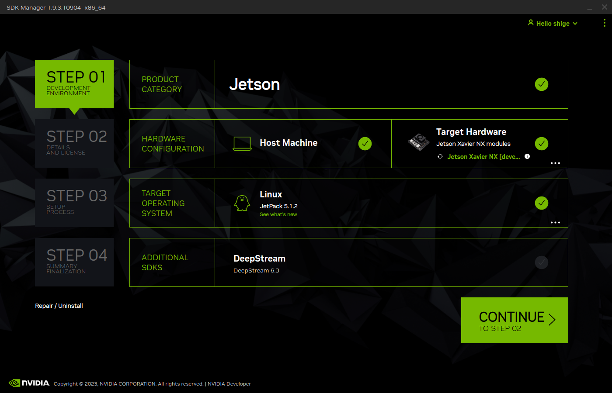
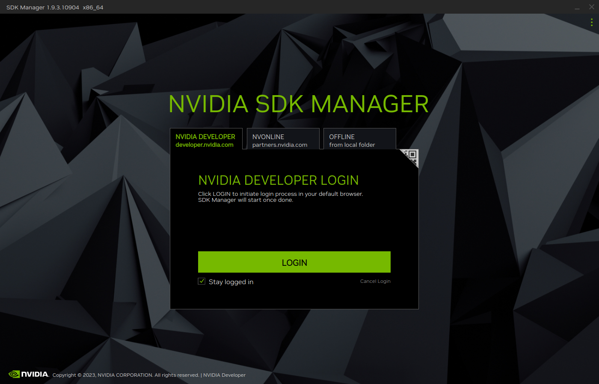

# Nvidia-sdkmamanger-docker-gui



This repository provides a Dockerfile and script files to use sdkmanager with a GUI within Docker.

## Operating Environment
Below are the operating environment and test results for Nvidia-sdkmanager-docker-gui.
- hostPC:
  - Ubuntu 22.04.3 LTS
- Jetpack Installation
  - Jetpack 5.1.1
  - Jetpack 5.0.2
  - Jetpack 4.6.4
- Creating the Clone Image

## Setting up the Docker Environment

### Installing and Setting up Docker

```bash
sudo apt install docker.io
sudo gpasswd -a $USER docker
sudo reboot
```

After rebooting your PC or Docker daemon, you'll be able to use the `docker` command without requiring sudo.

## Launching the Container

### 1. Creating the Docker Image

Clone this repository and change to the directory:
```bash
git clone https://github.com/IkuoShige/Nvidia-sdkmanager-docker-gui.git
cd Nvidia-sdkmanager-docker-gui/
```

To proceed, you need to log in to Nvidia's account and directly download the file from the following link:

https://developer.nvidia.com/sdk-manager

Generate the Docker image from the downloaded file:

```bash
docker load -i ~/Downloads/sdkmanager-<version>-Ubuntu_<distribution>_docker.tar.gz
```

Example:
```bash
docker load -i ~/Downloads/sdkmanager-1.9.3.10904-Ubuntu_20.04_docker.tar.gz
```

Build the container from the Docker image:
```shell
./build_docker_images.sh --ubuntu-version <distribution> --docker-version <sdkmanager-version>
```

Example:
```shell
./build_docker_images.sh --ubuntu-version 20.04 --docker-version 1.9.3.10904
```

* Note:
    * Use --ubuntu-version to set the Ubuntu distribution, similar to -v.
    * Use --docker-version to set the downloaded sdkmanager version.

### 2. Launching the Container

```shell
./launch_container.sh --ubuntu-version <distribution> --jetpack-home <path/to/jetpack_home>
```

Example:
```shell
./launch_container.sh --ubuntu-version 20.04 --jetpack-home ./jetpack_home
```

* Note:
    * Use --ubuntu-version to set the Ubuntu distribution. Default is 20.04.
    * Use --jetpack-home to set the parent directory of the nvidia directory created by sdkmanager. Default is ./jetpack.

## Running sdkmanager(GUI)

```bash
sdkmanager
```

After the initial startup, a login screen will appear. Press the LOGIN button to open Chrome and navigate to the Nvidia account login page. Enter your email address and password for authentication.

Once authenticated, you can select TARGET HARDWARE and TARGET OPERATING SYSTEM.

## Running sdkmanager(CLI)

To install Jetpack 5.1.1 on Jetson Xavier NX:
```bash
sdkmanager --cli install --logintype devzone --product Jetson --version 5.1.1 --targetos Linux --host --target JETSON_XAVIER_NX_TARGETS --flash all --additionalsdk 'DeepStream 6.2'
```